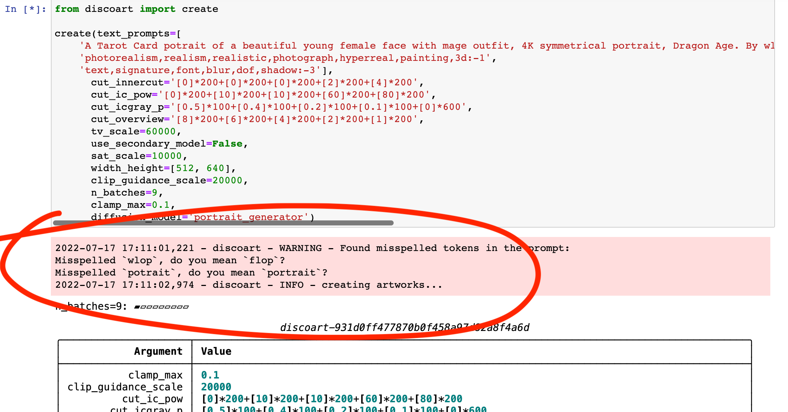
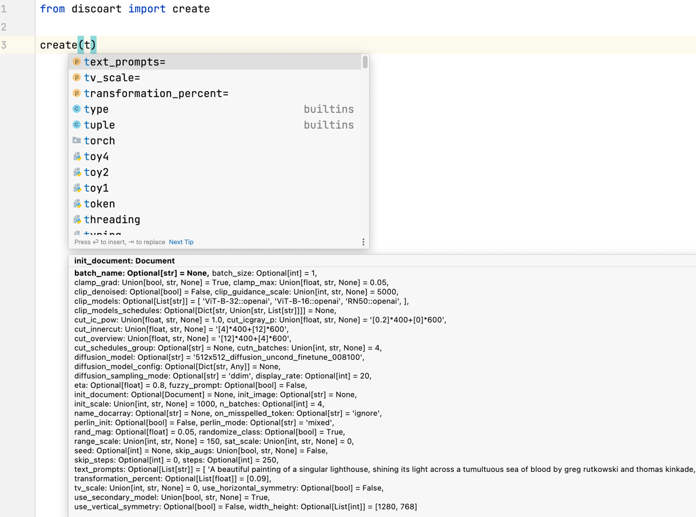
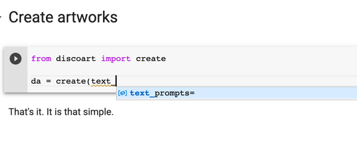
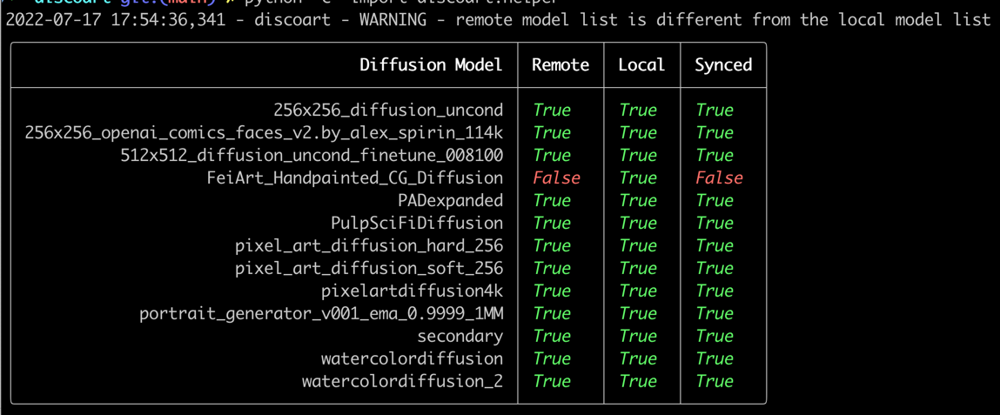

# DiscoArt vs. DD5.6

DiscoArt and DD5.6 follow the same algorithms, but DiscoArt has a much better implementation ([guaranteed by me](https://github.com/hanxiao)) with **top** code quality, **the best** user experience and **rich** features. It is perfect for integration to professional developers. 

DiscoArt is synced with the upstream update of original DD notebook. The list below summarizes the major differences between DiscoArt and DD5.6:

## Refactor & bug fixes
- Completely refactored the notebook implementation and aim for *best-in-class* quality. (I'm serious about this.)
- Fixes multiple bugs e.g. weighted prompts, cut scheduling in original DD5.6, which improves the generation quality.
- No dependency of IPython when not using in notebook/colab.
- Robust persistent storage for the generated images.
- Simpler interface and Pythonic API.

## Spellchecking

Typos in the prompts can lead to suboptimal image generation; and they are often hard to recognize. In DiscoArt, you will see a warning message when you have a typo as follows:



Artist names and common modifiers (e.g. `dof`, `artstation`) are added into whitelist to avoid the false alarm.

You can change `on_misspelled_token` parameter to enforce auto-correction as well.

## IDE support

When writing DiscoArt applications in PyCharm/VSCode/Jupyter/Google Colab, you will get <kbd>tab</kbd> complete and parameter hinting out of the box.





## Scheduling

The following variables can be either scalar variables in the type of bool, float or int; or can be scheduled via the syntax of `[val]*400+[val1]*100+[val2]*500` over 1000 steps.

- `cut_overview`
- `cut_innercut`
- `cut_icgray_p`
- `cut_ic_pow`
- `use_secondary_model`
- `cutn_batches`
- `skip_augs`
- `clip_guidance_scale`
- `cutn_batches`
- `tv_scale`
- `range_scale`
- `sat_scale`
- `init_scale`
- `clamp_grad`
- `clamp_max`

Also:
- `clip_models_schedules` is added to control the scheduling of clip models, the syntax is the same as `cut_overview` but as a bool list `[True]*400+[False]*600`.

## Customized diffusion

Latest diffusion models are automatically synced to local when they become available, there is no need to update the codebase.



- Support default 512x512, 256x256 diffusion model as well as Pixel Art Diffusion, Watercolor Diffusion, and Pulp SciFi Diffusion models.
- `diffusion_model` and `diffusion_model_config` can be specified load custom diffusion model and override the default diffusion model.

To list all supported diffusion models, 

```python
from discoart.helper import list_diffusion_models

list_diffusion_models()
```


## Feature changes
- DiscoArt does not support video generation and `image_prompt` (which was marked as ineffective in DD 5.4).
- Due to no video support, `text_prompts` in DiscoArt accepts a string or a list of strings, not a dictionary; i.e. no frame index `0:` or `100:`.
- `clip_models` accepts a list of values from [all open-clip pretrained models and weights](https://github.com/jina-ai/discoart/blob/main/discoart/resources/docstrings.yml#L90).

