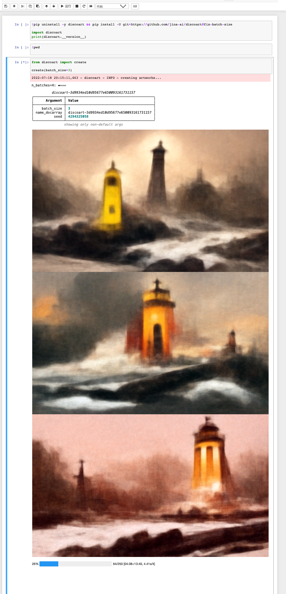
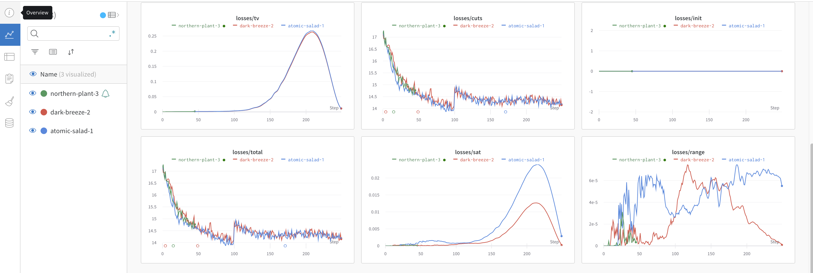

# DiscoArt vs. DD5.6

DiscoArt and DD5.6 start from the same family of algorithms (i.e. CLIP guided diffusion), but DiscoArt has a much better implementation ([guaranteed by me](https://github.com/hanxiao)) with **top** code quality, **the best** user experience and **rich** features. It is perfect for integration to professional developers. 

DiscoArt is synced with the upstream update of original DD notebook. The list below summarizes the major differences between DiscoArt and DD5.6:


## Refactor & bug fixes
- Completely refactored the notebook implementation and aim for *best-in-class* quality. (I'm serious about this.)
- Fixes multiple bugs e.g. weighted prompts, cut scheduling in original DD5.6, which improves the generation quality.
- No dependency of IPython when not using in notebook/colab.
- Robust persistent storage for the generated images.
- Simpler interface and Pythonic API.

## Prompt scheduling

Beside supporting the original prompts syntax in DD (i.e. `['prompts:weight', ...]`), DiscoArt >=0.8 supports a new prompt schema which
- allows one to schedule certain prompt on/off on certain steps;
- allows one to weight certain prompt on certain steps;
- allows one to schedule certain prompt on/off on certain CLIP models;
- explicitly defines the weight of each prompt;
- allows one to define the spellcheck strategy for each prompt;

Let's see an example to better understand the new syntax:

```python
text_prompts = {
    'version': '1',
    'prompts': [
        {'text': 'the main prompt', 'weight': 10, 'spellcheck': 'ignore'},
        {
            'text': 'the second prompt effective at later steps',
            'weight': 7,
            'schedule': '[False]*500+[True]*500',
        },
        {
            'text': 'some positive modifier',
            'weight': '[1]*100+[2]*300+[8]*600',
            'clip_guidance': ['RN50x4::openai'],
        },
        {'text': 'some negative modifier', 'weight': -4},
    ],
}
```

`text_prompts` is a dictionary that contains 2 required keys `version` and `prompts`:
- `version`: **(required)** the version of the schema. Currently, it is always `1`.
- `prompts`: **(required)** the list of prompts, where each prompt is a dictionary structured as follows:
   - `text`: **(required)** the text of the prompt.
   - `weight`: **(optional)** the weight of the prompt, can be positive or negative float or a schedule string, e.g. `[1]*100+[10]*500+[3]*400`. If not specified, it will be set to `1`, means `1` for all steps.
   - `schedule`: **(optional)** the schedule of the prompt. The syntax is similar to cut scheduling, i.e. `[True]*300+[False]*300+[True]*400`. When not specified, it will be set to `True`, which means prompt guidance will be effective at every step.
   - `clip_guidance`: **(optional)** the list of CLIP models to be used for the prompt. When not specified, it will be all CLIP models specified via `create(..., clip_models=...)`.
   - `spellcheck`: **(optional)** the spellcheck strategy of the prompt. If not specified, it will be set to `'ignore'`.

At every step, DiscoArt will check if the condition is met according to schedule step *and* CLIP guidance (remember in the DiscoArt, `clip_models_schedules` allows one to schedule CLIP on certain steps). If so, it will activate the prompt, otherwise it will deactivate the prompt, which means the prompt will not be involved in the loss computation. 

### Rationales of prompt scheduling

- Imagine a human painting where big picture comes first and then small details. Rarely we see people work on big picture small details **at the same time** or small details before big pictures. However, before DiscoArt 0.8, all prompts are involved in the loss computation at all steps. Prompt scheduling enables the possibility to have first thing first and details later.
- Don't look at me, you guys like sophisticated scheduling and you know that.

### Prompts as YAML 

Of course the above syntax is not the only way to define prompts. You can also define prompts in YAML format. For instance, the above example can be written as:

```yaml
text_prompts:
  version: 1
  prompts:
    - text: the main prompt
      weight: 10
      spellcheck: ignore
    - text: the second prompt effective at later steps
      weight: 7
      schedule: '[False]*500+[True]*500'
    - text: some positive modifier
      weight: 3
      clip_guidance: ['RN50x4::openai']
    - text: some negative modifier
      weight: -4
width_height: [512, 512]
```

Save it to `my.yml` and then load it in DiscoArt:

```bash
python -m discoart create my.yml
```


### Remark to legacy prompts syntax

The original DD-style prompt syntax `['prompts:weight', ...]` is still supported. However, here are some remarks:
- Prompt weights is now normalized via L2 norm, this normalization happens at every step based on the activated prompts. The original weighted by sum doesn't make sense from math perspective, hence it is removed.
- The restriction of "the sum of weights must not be 0 or negative" is waived, as this condition makes no sense in the first place, and it makes no sense under the new L2 normalization.
- When weight is provided in both `'text': prompts:weight` and `'weight': ` field, then `'weight': ` value overrides the former one.
- `fuzzy_prompt` is removed, as it is a good idea but ineffective implementation. If the intention is to add variance of the image by paraphrasing the prompts, then there must be a better way to do that.  
- For system integrations, it is highly recommended to follow the new syntax. It is more structured and less ambiguous.

## K-shot sampling in one run 

Here is a question: to generate 3 images with the same prompts & settings, would you rather do `n_batches=3` and `batch_size=1`, or `n_batches=1` and `batch_size=3`?

This is a trick question because in original DD5.6 one can not do `batch_size > 1`, it is not supported.

In DiscoArt, you can simply do:

```python
from discoart import create

create(batch_size=3)
```

Which means you can generate three images in one run. Not only this is faster than three runs, but it leverages loss function better and potentially yields higher quality images. 




## Weights & Biases integration

By default, all losses, cut schedules are logged to W&B, this allows you to track and analyze and design your schedule strategy professionally, instead of flying blind. One `create()` corresponds to one W&B **project**, each `n_batches` corresponds to one W&B **run**.



To turn off this feature, please use [W&B environment variables](https://docs.wandb.ai/guides/track/advanced/environment-variables).

## Spellchecking

Typos in the prompts can lead to suboptimal image generation; and they are often hard to recognize. In DiscoArt, you will see a warning message when you have a typo as follows:


Artist names and common modifiers (e.g. `dof`, `artstation`) are added into whitelist to avoid the false alarm.

You can change `on_misspelled_token` parameter to enforce auto-correction as well.

## IDE support

When writing DiscoArt applications in PyCharm/VSCode/Jupyter/Google Colab, you will get <kbd>tab</kbd> complete and parameter hinting out of the box.


## Scheduling

The following variables can be either scalar variables in the type of bool, float or int; or can be scheduled via the syntax of `[val]*400+[val1]*100+[val2]*500` over 1000 steps.

- `cut_overview`
- `cut_innercut`
- `cut_icgray_p`
- `cut_ic_pow`
- `use_secondary_model`
- `cutn_batches`
- `skip_augs`
- `clip_guidance_scale`
- `cutn_batches`
- `tv_scale`
- `range_scale`
- `sat_scale`
- `init_scale`
- `clamp_grad`
- `clamp_max`

Also:
- `clip_models_schedules` is added to control the scheduling of clip models, the syntax is the same as `cut_overview` but as a bool list `[True]*400+[False]*600`.

## Custom diffusion models

Latest diffusion models are automatically synced to local when they become available, there is no need to update the codebase.


- Support default 512x512, 256x256 diffusion model as well as Pixel Art Diffusion, Watercolor Diffusion, and Pulp SciFi Diffusion models.
- `diffusion_model` and `diffusion_model_config` can be specified load custom diffusion model and override the default diffusion model.

To use a listed diffusion model, you can do:

```python
from discoart import create

create(diffusion_model='portrait_generator', ...)
```

Note that you don't have to write the full name of the diffusion model, e.g. any prefix is enough.

To load a custom diffusion model from a local `.pt` file, you can do:

```python
from discoart import create

create(diffusion_model='/path/to/diffusion-model.pt', diffusion_model_config={...}, ...)
```

To list all supported diffusion models, 

```python
from discoart.helper import list_diffusion_models

list_diffusion_models()
```

You can also specify the environment variable `DISCOART_MODELS_YAML` to build your list of diffusion models.


## Feature changes
- DiscoArt does not support video generation and `image_prompt` (which was marked as ineffective in DD 5.4).
- Due to no video support, `text_prompts` in DiscoArt accepts a string or a list of strings, not a dictionary; i.e. no frame index `0:` or `100:`.
- `clip_models` accepts a list of values from [all open-clip pretrained models and weights](https://github.com/jina-ai/discoart/blob/main/discoart/resources/docstrings.yml#L90).

