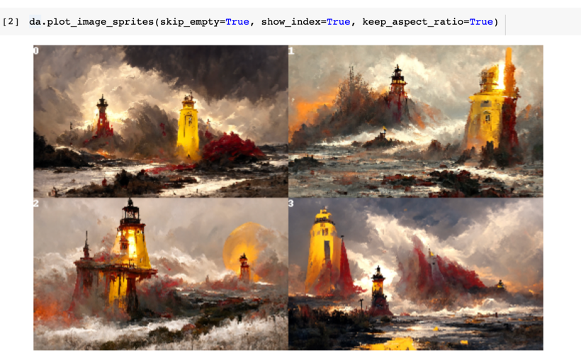

<p align="center">
<b>Create compelling Disco Diffusion artworks in one line</b>
</p>

<p align=center>
<a href="https://pypi.org/project/discoart/"></a>
<a href="https://hub.docker.com/repository/docker/jinaai/discoart"></a>
<a href="https://slack.jina.ai"></a>
<a href="https://colab.research.google.com/github/jina-ai/discoart/blob/main/discoart.ipynb"></a>
<a href="https://twitter.com/hxiao/status/1542967938369687552?s=20&t=DO27EKNMADzv4WjHLQiPFA"></a> 
</p>

DiscoArt is an elegant way of creating compelling Disco Diffusion<sup><a href="#example-application">[*]</a></sup> artworks for generative artists, AI enthusiasts and hard-core developers. DiscoArt has a modern & professional API with a beautiful codebase, ensuring high usability and maintainability. It introduces handy features such as result recovery and persistence, gRPC/HTTP serving w/o TLS, post-analysis, easing the integration to larger cross-modal or multi-modal applications.

<sub><sup><a id="example-application">[*]</a> 
Disco Diffusion is a Google Colab Notebook that leverages CLIP-Guided Diffusion to allow one to create compelling and beautiful images from text prompts.
</sup></sub>

👼 **Available to all**: fully optimized for Google Colab *free tier*! Perfect for those who don't own GPU by themselves.

🎨 **Focus on create not code**: one-liner `create()` with a Pythonic interface, autocompletion in IDE, and powerful features. Fetch real-time results anywhere anytime, no more worry on session outrage on Google Colab. Set initial state easily for more efficient parameter exploration.

🏭 **Ready for integration & production**: built on top of [DocArray](https://github.com/jina-ai/docarray) data structure, enjoy smooth integration with [Jina](https://github.com/jina-ai/jina), [CLIP-as-service](https://github.com/jina-ai/clip-as-service) and other cross-/multi-modal applications.

## Install

```bash
pip install discoart
```

If you are not using DiscoArt under Google Colab, then other dependencies might be required.

## Get Started

<a href="https://colab.research.google.com/github/jina-ai/discoart/blob/main/discoart.ipynb"></a>

### Create artworks

```python
from discoart import create

da = create()
```

That's it! It will create with the [default text prompts and parameters](./discoart/resources/default.yml).


### Set prompts and parameters

Suppported parameters are [listed here](./discoart/resources/default.yml). You can specify them in `create()`:

```python
from discoart import create

da = create(text_prompts='A painting of sea cliffs in a tumultuous storm, Trending on ArtStation.',
            init_image='https://d2vyhzeko0lke5.cloudfront.net/2f4f6dfa5a05e078469ebe57e77b72f0.png',
            skip_steps=100)
```


[This docs explains those parameters in very details.](https://docs.google.com/document/d/1l8s7uS2dGqjztYSjPpzlmXLjl5PM3IGkRWI3IiCuK7g/mobilebasic) The minor difference on the parameters between DiscoArt and DD5.x [is explained here](#whats-next).


### Visualize results

`create()` returns `da`, a [DocumentArray](https://docarray.jina.ai/fundamentals/documentarray/)-type object. It contains the following information:
- All arguments passed to `create()` function, including seed, text prompts and model parameters.
- The generated image and its intermediate images.

This allows you to further post-process, analyze, export the results with powerful DocArray API.

For example, you can display all final images in a grid:

```python
da.plot_image_sprites(skip_empty=True, fig_size=(10, 10), show_index=True)
```


Note that all images perspective are preserved. You can display them one by one:

```python
for d in da:
    d.display()
```

The length of `da` is determined by the `n_batches` parameter.

You can take one particular run:

```python
da[0].display()
```


Images are stored as Data URI in `.uri`, to save it as a local file:

```python
da[0].save_uri_to_file('discoart-result.png')
```

You can also zoom into a run and check out intermediate steps:

```python
da[0].chunks.plot_image_sprites(skip_empty=True, fig_size=(10, 10), show_index=True)
```


You can `.display()` the chunks one by one, or save one via `.save_uri_to_file()`.

Finally, you can review its parameters via:

```python
da[0].tags
```


### Pull results anywhere anytime

If you are a free-tier Google Colab user, one annoy thing is the lost of sessions from time to time. Or sometimes you just early stop the run as the first image is not good enough, and a keyboard interrupt will prevent `.create()` to return any result. Either case, you can easily recover the results by pulling the last session ID.

1. Find the session ID. It appears on top of the image. 


2. Pull the result via that ID **on any machine at any time**, not necessarily on Google Colab:
    ```python
    from docarray import DocumentArray

    da = DocumentArray.pull('discoart-3205998582')
    ```

### Reuse a Document as the initial state

One can use a Document as the initial state for the next run. Its `.tags` will be used as the initial parameters; `.uri` if presented will be used as the initial image.

```python
from discoart import create
from docarray import DocumentArray

da = DocumentArray.pull('discoart-3205998582')
create(init_document=da[0], skip_steps=100)
```


### Verbose logs

You can also get verbose logs by setting the following lines before import `discoart`:

```python
import os

os.environ['DISCOART_LOG_LEVEL'] = 'DEBUG'
```

### Run in Docker

[](https://hub.docker.com/repository/docker/jinaai/discoart)

We provide a prebuilt Docker image for running DiscoArt in the Jupyter Notebook. 

```bash
# docker build . -t jinaai/discoart  # if you want to build yourself
docker run -p 51000:8888 -v $(pwd):/home/jovyan/ --gpus all jinaai/discoart
```


## What's next?

[Next is create](https://colab.research.google.com/github/jina-ai/discoart/blob/main/discoart.ipynb).

😎 **If you are already a DD user**: you are ready to go! There is no extra learning, DiscoArt respects the same parameter semantics as DD5.2. So just unleash your creativity!

There are some differences between DiscoArt and DD5.x:
  - DiscoArt does not support video generation and `image_prompt` (which was marked as ineffective in DD 5.2).
  - Due to no video support, `text_prompts` in DiscoArt accepts a string or a list of strings, not a dictionary; i.e. no frame index `0:` or `100:`.
  - `clip_models` accepts a list of values chosen from `ViT-B/32`, `ViT-B/16`, `ViT-L/14`, `RN101`, `RN50`, `RN50x4`, `RN50x16`, `RN50x64`. Slightly different in names vs. DD5.2. 

👶 **If you are a [DALL·E Flow](https://github.com/jina-ai/dalle-flow/) user**: you may want to take step by step, as Disco Diffusion works in a very different way than DALL·E. It is much more advanced and powerful: e.g. Disco Diffusion can take weighted & structured text prompts; it can initialize from a image with controlled noise; and there are way more parameters one can tweak. Impatient prompt like `"armchair avocado"` will give you nothing but confusion and frustration. I highly recommend you to check out the following resources before trying your own prompt:
- [Zippy's Disco Diffusion Cheatsheet v0.3](https://docs.google.com/document/d/1l8s7uS2dGqjztYSjPpzlmXLjl5PM3IGkRWI3IiCuK7g/mobilebasic)
- [EZ Charts - Diffusion Parameter Studies](https://docs.google.com/document/d/1ORymHm0Te18qKiHnhcdgGp-WSt8ZkLZvow3raiu2DVU/edit#)
- [Disco Diffusion 70+ Artist Studies](https://weirdwonderfulai.art/resources/disco-diffusion-70-plus-artist-studies/)
- [A Traveler’s Guide to the Latent Space](https://sweet-hall-e72.notion.site/A-Traveler-s-Guide-to-the-Latent-Space-85efba7e5e6a40e5bd3cae980f30235f#e122e748b86e4fc0ad6a7a50e46d6e10)

<!-- start support-pitch -->
## Support

- Join our [Slack community](https://slack.jina.ai) and chat with other community members about ideas.
- Join our [Engineering All Hands](https://youtube.com/playlist?list=PL3UBBWOUVhFYRUa_gpYYKBqEAkO4sxmne) meet-up to discuss your use case and learn Jina's new features.
    - **When?** The second Tuesday of every month
    - **Where?**
      Zoom ([see our public events calendar](https://calendar.google.com/calendar/embed?src=c_1t5ogfp2d45v8fit981j08mcm4%40group.calendar.google.com&ctz=Europe%2FBerlin)/[.ical](https://calendar.google.com/calendar/ical/c_1t5ogfp2d45v8fit981j08mcm4%40group.calendar.google.com/public/basic.ics))
      and [live stream on YouTube](https://youtube.com/c/jina-ai)
- Subscribe to the latest video tutorials on our [YouTube channel](https://youtube.com/c/jina-ai)

## Join Us

DiscoArt is backed by [Jina AI](https://jina.ai) and licensed under [MIT License](./LICENSE). [We are actively hiring](https://jobs.jina.ai) AI engineers, solution engineers to build the next neural search ecosystem in open-source.

<!-- end support-pitch -->
