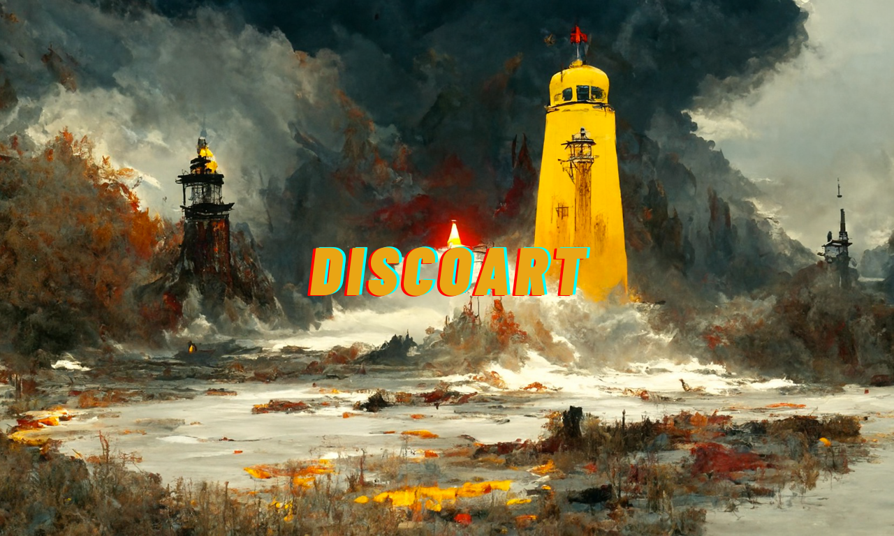
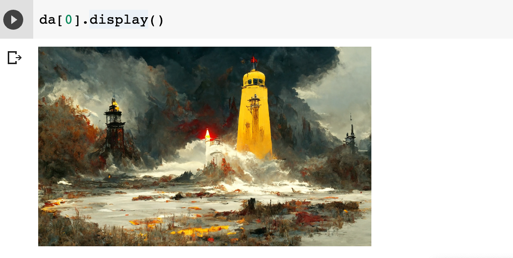
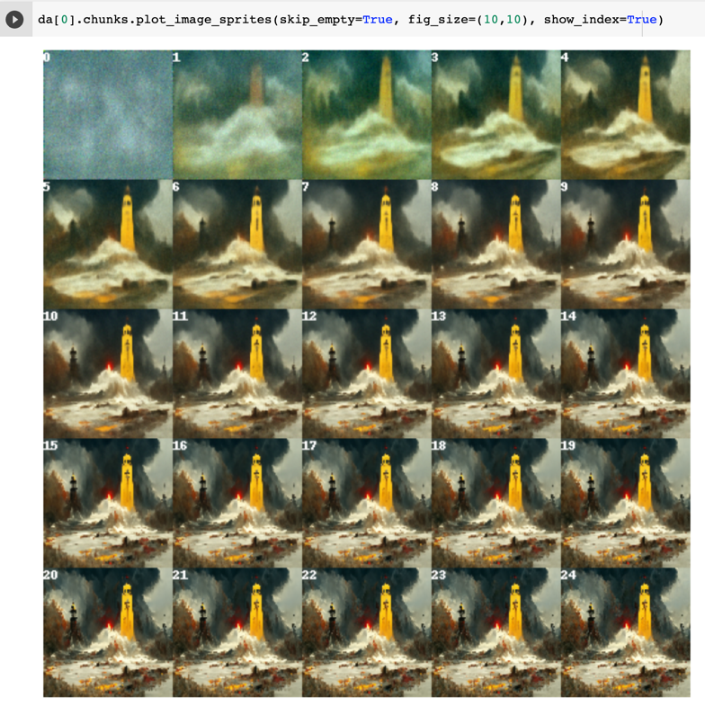
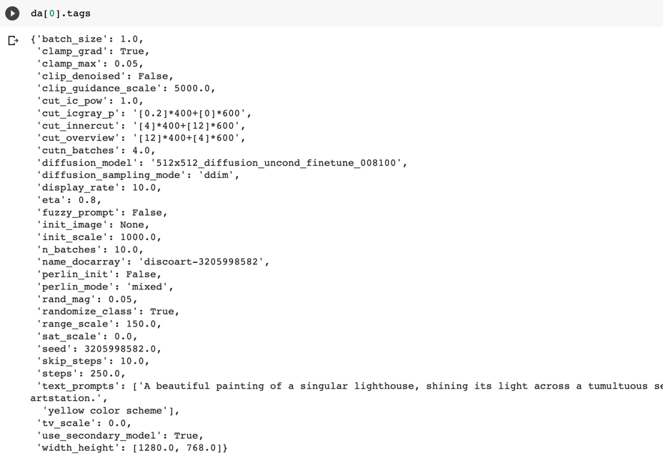
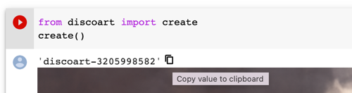

<p align="center">
<b>Create Disco Diffusion artworks in one line</b>
</p>

<p align=center>
<a href="https://pypi.org/project/discoart/"></a>
<a href="https://slack.jina.ai"></a>
<a href="https://colab.research.google.com/github/jina-ai/dalle-flow/blob/main/client.ipynb"></a>
</p>

DiscoArt is an elegant way of creating Disco Diffusion<sup><a href="#example-application">[*]</a></sup> artworks for generative artists, AI enthusiasts and hard-core developers. DiscoArt has a modern & professional API with a beautiful codebase, ensuring high usability and maintainability. It introduces handy features such as result recovery and persistence, gRPC/HTTP serving w/o TLS, post-analysis, easing the integration to larger cross-modal or multi-modal applications.

<sub><sup><a id="example-application">[*]</a> 
Disco Diffusion is a Google Colab Notebook that leverages CLIP-Guided Diffusion to allow one to create compelling and beautiful images from text prompts.
</sup></sub>

👼 **Available to all**: fully optimized for Google Colab *free tier*! Perfect for those who don't own GPU by themselves.

🎨 **Focus on creating not coding**: one-liner `create()` with Pythonic interfaces and powerful features. Fetch real-time results anywhere anytime, no more worry on session outrage on Google Colab free tier.

🏭 **Ready for integration & production**: built on top of [DocArray](https://github.com/jina-ai/docarray) data structure, enjoy smooth integration with [Jina](https://github.com/jina-ai/jina), [CLIP-as-service](https://github.com/jina-ai/clip-as-service) and other cross-/multi-modal applications.

## Install

```bash
pip install discoart
```

If you are not using DiscoArt under Google Colab, then other dependencies might be required.

## Get Started

This Google Colab Notebook provides a walkthrough of DiscoArt.

### Create artworks

```python
from discoart import create

da = create()
```

That's it! It will create with the [default text prompts and parameters](./discoart/resources/default.yml).


### Fetch results

`create()` returns `da`, a [DocumentArray](https://docarray.jina.ai/fundamentals/documentarray/)-type object. It contains the following information:
- All arguments passed to `create()` function, including seed, text prompts and model parameters.
- The generated image and its intermediate images.

This allows you to further post-process, analyze, export the results with powerful DocArray API.

For example, you can display all final images in a grid:

```python
da.plot_image_sprites(skip_empty=True, fig_size=(10, 10), show_index=True)
```

Or the final image of one particular run:

```python
da[0].display()
```



You can zoom into that run and display images on the intermediate steps:

```python
da[0].chunks.plot_image_sprites(skip_empty=True, fig_size=(10, 10), show_index=True)
```


Finally, you can review its parameters via:

```python
da[0].tags
```


### Recover from failure and interrupts

If you are a free-tier Google Colab user, one annoy thing is the lost of sessions from time to time. With DiscoArt, you can easily recover the results by pulling the last session ID.

1. Find the session ID. It appears on top of the image. 


2. Pull the result via that ID **on any machine at any time**, not necessarily on Google Colab:
    ```python
    from docarray import DocumentArray

    da = DocumentArray.pull('discoart-3205998582')
    ```

### Specify parameters

DiscoArt support parameters are [listed here](./discoart/resources/default.yml). You can specify them directly in `create()`:

```python
from discoart import create

create(text_prompts='A painting of sea cliffs in a tumultuous storm, Trending on ArtStation.',
       init_image='https://d2vyhzeko0lke5.cloudfront.net/2f4f6dfa5a05e078469ebe57e77b72f0.png',
       skip_steps=100)
```


[This docs explains those parameters in very details.](https://docs.google.com/document/d/1l8s7uS2dGqjztYSjPpzlmXLjl5PM3IGkRWI3IiCuK7g/mobilebasic)

### Verbose logs

You can also get verbose logs by setting the following lines before import `discoart`:

```python
import os

os.environ['DISCOART_LOG_LEVEL'] = 'DEBUG'
```

<!-- start support-pitch -->
## Support

- Join our [Slack community](https://slack.jina.ai) and chat with other community members about ideas.
- Join our [Engineering All Hands](https://youtube.com/playlist?list=PL3UBBWOUVhFYRUa_gpYYKBqEAkO4sxmne) meet-up to discuss your use case and learn Jina's new features.
    - **When?** The second Tuesday of every month
    - **Where?**
      Zoom ([see our public events calendar](https://calendar.google.com/calendar/embed?src=c_1t5ogfp2d45v8fit981j08mcm4%40group.calendar.google.com&ctz=Europe%2FBerlin)/[.ical](https://calendar.google.com/calendar/ical/c_1t5ogfp2d45v8fit981j08mcm4%40group.calendar.google.com/public/basic.ics))
      and [live stream on YouTube](https://youtube.com/c/jina-ai)
- Subscribe to the latest video tutorials on our [YouTube channel](https://youtube.com/c/jina-ai)

## Join Us

DiscoArt is backed by [Jina AI](https://jina.ai) and licensed under [Apache-2.0](./LICENSE). [We are actively hiring](https://jobs.jina.ai) AI engineers, solution engineers to build the next neural search ecosystem in open-source.

<!-- end support-pitch -->