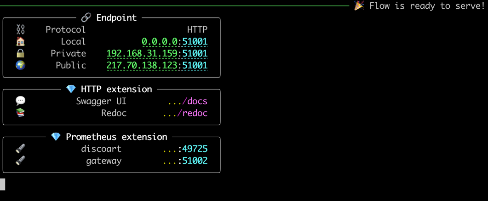

<p align="center">
<b>Create compelling Disco Diffusion artworks in one line</b>
</p>

<p align=center>
<a href="https://pypi.org/project/discoart/"></a>
<a href="https://hub.docker.com/repository/docker/jinaai/discoart"></a>
<a href="https://slack.jina.ai"></a>
<a href="https://colab.research.google.com/github/jina-ai/discoart/blob/main/discoart.ipynb"></a>
</p>

DiscoArt is an elegant way of creating compelling Disco Diffusion<sup><a href="#example-application">[*]</a></sup> artworks for generative artists, AI enthusiasts and hard-core developers. DiscoArt has a modern & professional API with a beautiful codebase, ensuring high usability and maintainability. It introduces handy features such as result recovery and persistence, gRPC/HTTP serving w/o TLS, post-analysis, easing the integration to larger cross-modal or multi-modal applications.

<sub><sup><a id="example-application">[*]</a> 
Disco Diffusion is a Google Colab Notebook that leverages CLIP-Guided Diffusion to allow one to create compelling and beautiful images from text prompts.
</sup></sub>


💯 **Best-in-class**: top-notch code quality, correctness-first, minimum dependencies; including bug fixes, feature improvements [vs. the original DD5.5](FEATURES.md). 

👼 **Available to all**: smooth install for *self-hosting*, Google Colab *free tier*, and non-GUI (IPython) environment! No brainfuck, no dependency hell, no stackoverflow. 

🎨 **Focus on create not code**: one-liner `create()` with a Pythonic interface, autocompletion in IDE, and powerful features. Fetch real-time results anywhere anytime, no more worry on session outrage on Google Colab. Set initial state easily for more efficient parameter exploration.

🏭 **Ready for integration & production**: built on top of [DocArray](https://github.com/jina-ai/docarray) data structure, enjoy smooth integration with [Jina](https://github.com/jina-ai/jina), [CLIP-as-service](https://github.com/jina-ai/clip-as-service) and other cross-/multi-modal applications.

☁️ [**As-a-service**](#serving): simply `python -m discoart.serve`, DiscoArt is now a high-performance low-latency service supports gRPC/HTTP/websockets and TLS. Scaling up/down is one-line; Cloud-native features e.g. Kubernetes, Prometheus and Grafana is one-line. [Unbelievable simple thanks to Jina](https://github.com/jina-ai/jina).


## [Gallery with prompts](https://twitter.com/hxiao/status/1542967938369687552?s=20&t=DO27EKNMADzv4WjHLQiPFA) 
## Install

Python 3.7+ and CUDA-enabled PyTorch is required.

```bash
pip install discoart
```

This applies to both *self-hosting*, *Google Colab* and non-GUI environments.

- **Self-hosted Jupyter**: if you want to use it in a Jupyter Notebook on your own GPU machine, the easiest way is to [use our prebuilt Docker image](#run-in-docker).
- **Using it as a service**: [`python -m discoart.serve`](#serving)

## Get Started

<a href="https://colab.research.google.com/github/jina-ai/discoart/blob/main/discoart.ipynb"></a>

### Create artworks

```python
from discoart import create

da = create()
```

That's it! It will create with the [default text prompts and parameters](./discoart/resources/default.yml).


### Set prompts and parameters

Supported parameters are [listed here](./discoart/resources/default.yml). You can specify them in `create()`:

```python
from discoart import create

da = create(
    text_prompts='A painting of sea cliffs in a tumultuous storm, Trending on ArtStation.',
    init_image='https://d2vyhzeko0lke5.cloudfront.net/2f4f6dfa5a05e078469ebe57e77b72f0.png',
    skip_steps=100,
)
```


In case you forgot a parameter, just lookup the cheatsheet at anytime:

```python
from discoart import cheatsheet

cheatsheet()
```

The difference on the parameters between DiscoArt and DD5.5 [is explained here](./FEATURES.md). 


### Visualize results

`create()` returns `da`, a [DocumentArray](https://docarray.jina.ai/fundamentals/documentarray/)-type object. It contains the following information:
- All arguments passed to `create()` function, including seed, text prompts and model parameters.
- 4 generated image and its intermediate steps' images, where `4` is determined by `n_batches` and is the default value. 

This allows you to further post-process, analyze, export the results with powerful DocArray API.

Images are stored as Data URI in `.uri`, to save the first image as a local file:

```python
da[0].save_uri_to_file('discoart-result.png')
```

To save all final images:

```python
for idx, d in enumerate(da):
    d.save_uri_to_file(f'discoart-result-{idx}.png')
```

You can also display all four final images in a grid:

```python
da.plot_image_sprites(skip_empty=True, show_index=True, keep_aspect_ratio=True)
```


Or display them one by one:

```python
for d in da:
    d.display()
```

Or take one particular run:

```python
da[0].display()
```


### Visualize intermediate steps

You can also zoom into a run (say the first run) and check out intermediate steps:

```python
da[0].chunks.plot_image_sprites(
    skip_empty=True, show_index=True, keep_aspect_ratio=True
)
```


You can `.display()` the chunks one by one, or save one via `.save_uri_to_file()`, or save all intermediate steps as a GIF:

```python
da[0].chunks.save_gif(
    'lighthouse.gif', show_index=True, inline_display=True, size_ratio=0.5
)
```


### Export configs

You can review its parameters from `da[0].tags` or export it as an SVG image:

```python
from discoart.config import save_config_svg

save_config_svg(da)
```


### Pull results anywhere anytime

If you are a free-tier Google Colab user, one annoy thing is the lost of sessions from time to time. Or sometimes you just early stop the run as the first image is not good enough, and a keyboard interrupt will prevent `.create()` to return any result. Either case, you can easily recover the results by pulling the last session ID.

1. Find the session ID. It appears on top of the image. 


2. Pull the result via that ID **on any machine at any time**, not necessarily on Google Colab:
    ```python
    from docarray import DocumentArray

    da = DocumentArray.pull('discoart-3205998582')
    ```

### Reuse a Document as initial state

Consider a Document as a self-contained data with config and image, one can use it as the initial state for the future run. Its `.tags` will be used as the initial parameters; `.uri` if presented will be used as the initial image.

```python
from discoart import create
from docarray import DocumentArray

da = DocumentArray.pull('discoart-3205998582')

create(
    init_document=da[0],
    cut_ic_pow=0.5,
    tv_scale=600,
    cut_overview='[12]*1000',
    cut_innercut='[12]*1000',
    use_secondary_model=False,
)
```


### Environment variables

You can set environment variables to control the meta-behavior of DiscoArt. The environment variables must be set before importing DiscoArt, either in Bash or in Python via `os.environ`.

```bash
DISCOART_LOG_LEVEL='DEBUG' # more verbose logs
DISCOART_OPTOUT_CLOUD_BACKUP='1' # opt-out from cloud backup
DISCOART_DISABLE_IPYTHON='1' # disable ipython dependency
DISCOART_DISABLE_RESULT_SUMMARY='1' # disable result summary after the run ends
DISCOART_DEFAULT_PARAMETERS_YAML='path/to/your-default.yml' # use a custom default parameters file
DISCOART_CUT_SCHEDULES_YAML='path/to/your-schedules.yml' # use a custom cut schedules file
DISCOART_MODELS_YAML='path/to/your-models.yml' # use a custom list of models file
```

### Run in Docker

[](https://hub.docker.com/repository/docker/jinaai/discoart)

We provide a prebuilt Docker image for running DiscoArt in the Jupyter Notebook. 

```bash
# docker build . -t jinaai/discoart  # if you want to build yourself
docker run -p 51000:8888 -v $(pwd):/home/jovyan/ -v $HOME/.cache:/root/.cache --gpus all jinaai/discoart
```

To update Docker image to latest version:

```bash
docker pull jinaai/discoart:latest
```

[Docker images are built on every release](https://hub.docker.com/repository/docker/jinaai/discoart), so one can lock it to a specific version, say `0.5.1`:

```bash
docker run -p 51000:8888 -v $(pwd):/home/jovyan/ -v $HOME/.cache:/root/.cache --gpus all jinaai/discoart:0.5.1
```


## Serving

Serving DiscoArt is super easy. Simply run the following command:

```bash
python -m discoart.serve
```

You shall see:



Now send request to the server via curl/Javascript, e.g.

```bash
curl \
-X POST http://0.0.0.0:51001/post \  # use private/public if your server is remote
-H 'Content-Type: application/json' \
-d '{"parameters": {"text_prompts": ["A beautiful painting of a singular lighthouse", "yellow color scheme"]}}'
```

That's it. 

You can of course pass all parameters that accepted by `create()` function in the JSON.

### Scaling out

If you have multiple GPUs and you want to run multiple DiscoArt instances in parallel by leveraging GPUs in a time-multiplexed fashion, you can copy-paste the [default `flow.yml` file](./discoart/resources/flow.yml) and modify it as follows:

```yaml
jtype: Flow
with:
  protocol: http
  monitoring: true
  port: 51001
  port_monitoring: 51002  # prometheus monitoring port
  env:
    JINA_LOG_LEVEL: debug
    DISCOART_DISABLE_IPYTHON: 1
    DISCOART_DISABLE_RESULT_SUMMARY: 1
executors:
  - name: discoart
    uses: DiscoArtExecutor
    env:
      CUDA_VISIBLE_DEVICES: RR0:3  # change this if you have multiple GPU
    replicas: 3  # change this if you have larger VRAM
```

Here `replicas: 3` says spawning three DiscoArt instances, `CUDA_VISIBLE_DEVICES: RR0:3` makes sure they use the first three GPUs in a round-robin fashion.

Name it as `myflow.yml` and then run `python -m discoart.serve myflow.yml` again.

### Customization

You can change the port number; change protocol to gRPC/Websockets; add TLS encryption; enable/disable Prometheus monitoring; you can also export it to Kubernetes deployment bundle simply via:

```bash
jina export kubernetes myflow.yml
```

For more features and YAML configs, [please check out Jina](https://github.com/jina-ai/jina).


### Hosting on Google Colab

Though not recommended, it is also possible to use Google Colab to host DiscoArt server. 
Please check out the following tutorials:
- https://docs.jina.ai/how-to/google-colab/
- https://clip-as-service.jina.ai/hosting/colab/

## What's next?

[Next is create](https://colab.research.google.com/github/jina-ai/discoart/blob/main/discoart.ipynb).

😎 **If you are already a DD user**: you are ready to go! There is no extra learning, DiscoArt respects the same parameter semantics as DD5.5. So just unleash your creativity! [Read more about their differences here](./FEATURES.md).

You can always do `from discoart import cheatsheet; cheatsheet()` to check all new/modified parameters.

👶 **If you are a [DALL·E Flow](https://github.com/jina-ai/dalle-flow/) or new user**: you may want to take step by step, as Disco Diffusion works in a very different way than DALL·E. It is much more advanced and powerful: e.g. Disco Diffusion can take weighted & structured text prompts; it can initialize from a image with controlled noise; and there are way more parameters one can tweak. Impatient prompt like `"armchair avocado"` will give you nothing but confusion and frustration. I highly recommend you to check out the following resources before trying your own prompt:
- [Zippy's Disco Diffusion Cheatsheet v0.3](https://docs.google.com/document/d/1l8s7uS2dGqjztYSjPpzlmXLjl5PM3IGkRWI3IiCuK7g/mobilebasic)
- [EZ Charts - Diffusion Parameter Studies](https://docs.google.com/document/d/1ORymHm0Te18qKiHnhcdgGp-WSt8ZkLZvow3raiu2DVU/edit#)
- [Disco Diffusion 70+ Artist Studies](https://weirdwonderfulai.art/resources/disco-diffusion-70-plus-artist-studies/)
- [A Traveler’s Guide to the Latent Space](https://sweet-hall-e72.notion.site/A-Traveler-s-Guide-to-the-Latent-Space-85efba7e5e6a40e5bd3cae980f30235f#e122e748b86e4fc0ad6a7a50e46d6e10)
- [Disco Diffusion Illustrated Settings](https://coar.notion.site/Disco-Diffusion-Illustrated-Settings-cd4badf06e08440c99d8a93d4cd39f51)
- [Coar’s Disco Diffusion Guide](https://coar.notion.site/coar/Coar-s-Disco-Diffusion-Guide-3d86d652c15d4ca986325e808bde06aa#8a3c6e9e4b6847afa56106eacb6f1f79)

<!-- start support-pitch -->
## Support

- Join our [Slack community](https://slack.jina.ai) and chat with other community members about ideas.
- Join our [Engineering All Hands](https://youtube.com/playlist?list=PL3UBBWOUVhFYRUa_gpYYKBqEAkO4sxmne) meet-up to discuss your use case and learn Jina's new features.
    - **When?** The second Tuesday of every month
    - **Where?**
      Zoom ([see our public events calendar](https://calendar.google.com/calendar/embed?src=c_1t5ogfp2d45v8fit981j08mcm4%40group.calendar.google.com&ctz=Europe%2FBerlin)/[.ical](https://calendar.google.com/calendar/ical/c_1t5ogfp2d45v8fit981j08mcm4%40group.calendar.google.com/public/basic.ics))
      and [live stream on YouTube](https://youtube.com/c/jina-ai)
- Subscribe to the latest video tutorials on our [YouTube channel](https://youtube.com/c/jina-ai)

## Join Us

DiscoArt is backed by [Jina AI](https://jina.ai) and licensed under [MIT License](./LICENSE). [We are actively hiring](https://jobs.jina.ai) AI engineers, solution engineers to build the next neural search ecosystem in open-source.

<!-- end support-pitch -->
